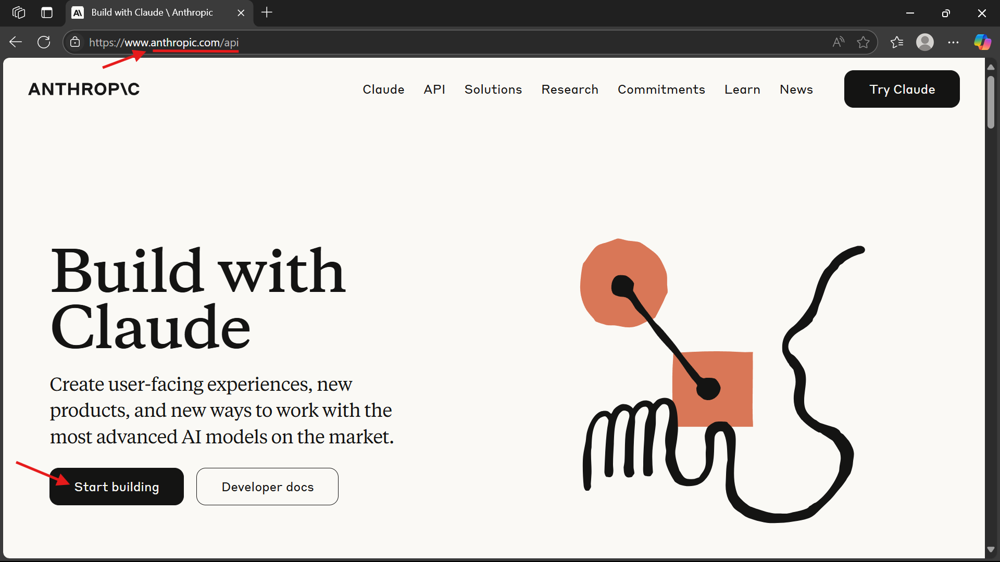

# AI-Powered PDFs Chat System with Claude, LlamaIndex, Streamlit, ChromaDB and SQLite

A Streamlit-based chatbot that lets you upload PDF documents and ask questions about their content using Anthropic Claude LLM, LlamaIndex for retrieval, and ChromaDB for vector storage. Chat histories are saved in SQLite for session management.

---
 
## 📚 Table of Contents

1. [🚀 Features](#-features)  
2. [⚙️ Technical Details](#technical-details)  
3. [📁 Project Structure](#-project-structure)  
4. [🚀 Getting Started](#getting-started)  
   - [Prerequisites](#prerequisites)  
   - [Installation](#installation)  
   - [Running the App](#running-the-app)  
5. [🔁 Workflow Overview](#-workflow-overview)  
   - [1. User Interface (`ui.py`)](#1-user-interface-uipy)  
   - [2. PDF Handling (`knowledge.py`)](#2-pdf-handling-knowledgepy)  
   - [3. Vector Store Management (`memorypy`, `knowledgepy`)](#3-vector-store-management-memorypy-knowledgepy)  
   - [4. Agent Response Generation (`agent.py`)](#4-agent-response-generation-agentpy)  
   - [5. Chat History (`storage.py`)](#5-chat-history-storagepy)  
   - [6. Logging (`logging_config.py`)](#6-logging-logging_configpy)  
6. [🔄 Typical Usage Flow](#-typical-usage-flow)  
7. [🧪 Sample Questions and Answers](#-sample-questions-and-answers)
8. [🙌 Acknowledgments](#acknowledgments) 

---

## 🚀 Features

- Upload multiple PDF files per chat session
- Extract and index PDF text for semantic search
- Ask questions answered contextually by Claude (Anthropic)
- Persistent vector store using ChromaDB
- Chat history saved with SQLite and browsable in sidebar
- Delete chat sessions with confirmation
- Pagination for recent chat sessions
- Robust logging of errors and info

---

## ⚙️ Technical Details

- PDF Parsing: Uses PyMuPDF for extracting text.
- Vector Store: ChromaDB stores document embeddings persistently.
- Embeddings: Generated by sentence-transformers/all-MiniLM-L6-v2.
- LLM: Anthropic Claude 3 via llama-index integration.
- Chat History: SQLite database stores messages and metadata.

    ```text
    +-----------------------+       1 ────────> ∞      +--------------------+
    | chat_history_metadata |--------------------------|   chat_history     |
    +-----------------------+                          +--------------------+
    | session_id (PK)       |                          | session_id (FK)    |
    | title                 |                          | timestamp          |
    +-----------------------+                          | role               |
                                                       | message            |
                                                       +--------------------+

    ```
- Logging: Logs errors to chat_errors.log and info to console.

---

## 📁 Project Structure

```text
root/
│
├── config.py                  # Configuration file: API keys, file paths, constants
├── agent.py                   # Handles LLM interaction with Claude via LlamaIndex
├── knowledge.py               # Parses and indexes PDF content for retrieval
├── memory.py                  # Manages ChromaDB vector store operations
├── storage.py                 # Handles SQLite chat history read/write operations
├── logging_config.py          # Sets up error and info logging across modules
├── ui.py                      # Main Streamlit app UI for uploading, chatting, browsing history
│
├── requirements.txt           # List of Python dependencies for the project
├── chat_history.db            # SQLite database (auto-created) storing chat messages and metadata
├── chroma_store/              # Persistent storage for vector embeddings (ChromaDB)
│   └── [session_id]/          # Stores vector data for each session
│
├── data/
│   └── pdfs/
│       └── [session_id]/      # Uploaded PDF files, organized per session
│
├── chat_errors.log            # Log file for tracking application errors
├── README.md                  # Project documentation and usage instructions
└── .gitignore                 # Specifies files/folders to exclude from version control
```
---

## 🚀 Getting Started

### Prerequisites

- [Python](https://www.python.org/downloads/)
- [Anthropic API key](https://www.anthropic.com/)
   
   
   
   
   
   
   
   
   
   
   

### Installation

1. Clone the repo:

    ```bash
    git clone https://github.com/ahmad-act/AI-Powered-PDFs-Chat-System-with-Claude-LlamaIndex-Streamlit-ChromaDB-and-SQLite.git
    cd AI-Powered-PDFs-Chat-System-with-Claude-LlamaIndex-Streamlit-ChromaDB-and-SQLite
    ```

2. Install dependencies:

    ```bash
    pip install -r requirements.txt
    ```

3. Configure your API key and paths in config.py:

    ```py
    ANTHROPIC_API_KEY = "your-anthropic-api-key"
    VECTOR_DB_DIR = "chroma_store"
    SQLITE_CHAT_HISTORY_DB_PATH = "chat_history.db"
    ```

### Running the App
  
  ```bash
  streamlit run ui.py --logger.level=debug
  ```

  Open your browser to [http://localhost:8501](http://localhost:8501) and start uploading PDFs!

---

## 🔁 Workflow Overview

### 1. User Interface (`ui.py`)

Launch via:
```bash
streamlit run ui.py
```
Users can:
- Upload PDF files
- Ask questions
- View previous sessions
- Browse or delete chat history

### 2. PDF Handling (knowledge.py)

- PDFs uploaded through Streamlit are saved in data/pdfs/[session_id]/
- Each file is saved and logged
- PDFs are parsed using PyMuPDFReader
- Text content is extracted and used to build a VectorStoreIndex with ChromaDB

### 3. Vector Store Management (memory.py, knowledge.py)

- ChromaVectorStore stores and retrieves document embeddings
- Embeddings generated using: sentence-transformers/all-MiniLM-L6-v2
- Persistent storage is managed under chroma_store/[session_id]/

### 4. Agent Response Generation (agent.py)

- Prompts defined using PromptTemplate
- Claude (Anthropic) model accessed via llama-index.llms.anthropic
- User queries are processed with vector-based context to generate responses

### 5. Chat History (storage.py)

- Questions and answers are saved in SQLite (chat_history.db)

- Two tables:
   - chat_history: stores individual messages
   - chat_history_metadata: stores session titles

- Used for:
   - Loading past sessions
   - Displaying conversations
   - Deleting sessions

### 6. Logging (logging_config.py)

- Errors logged to chat_errors.log
- Console displays INFO-level logs
- setup_logger() utility is used across modules like storage.py

---

## 🔄 Typical Usage Flow

- User visits the Streamlit UI.
- Uploads one or more PDF documents.
- PDFs are stored, parsed, and indexed using Chroma.
- User submits a question.
- Claude is prompted using a custom template and context from the vector store.
- Answer is displayed in the UI.
- All interactions are saved in the SQLite database.
- Sessions are shown in the sidebar with titles and pagination.
- Users can revisit or delete previous sessions.

---

## 🧪 Sample Questions and Answers

Questions based on the uploaded PDF:

```text
How does AI help full-stack developers work faster and better?
```


---

## 🙌 Acknowledgments

This project leverages the power of the following open-source tools and APIs:

- **[Anthropic Claude](https://www.anthropic.com/claude)**  
  Used as the main LLM for natural language understanding and responses.

- **[LlamaIndex](https://www.llamaindex.ai/)**  
  Serves as the framework for document indexing, retrieval, and LLM orchestration.

- **[ChromaDB](https://www.trychroma.com/)**  
  Vector store used for persistent, efficient storage of document embeddings.

- **[Streamlit](https://streamlit.io/)**  
  Enables rapid development of the interactive web-based user interface.

- **[Sentence Transformers](https://www.sbert.net/)**  
  Provides pre-trained transformer models for embedding generation and semantic search.

---